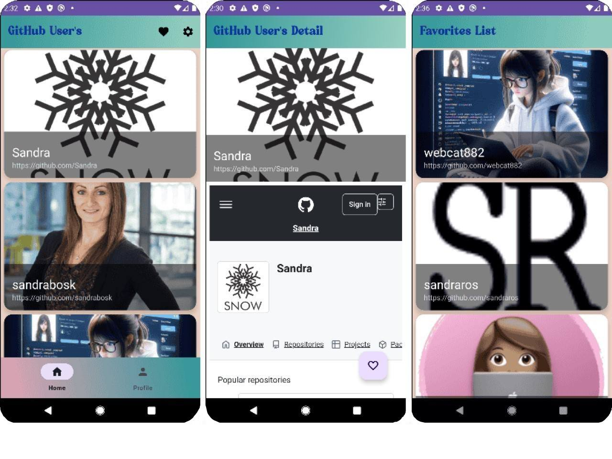

# GitHub Users

Menerapkan dependency rule dari Clean Architecture.

Menerapkan Reactive Programming menggunakan library Coroutine Flow untuk proses asynchronous secara lebih simpel dengan bantuan suspend function dan tanpa callback.

Menerapkan Dependency Injection menggunakan library Koin untuk mempermudah pengelolaan dependensi.

Menerapkan modularization menggunakan library Module untuk memecah project Android menjadi beberapa *module*.

Menerapkan Continuous Integration menggunakan Github dengan CI Server menggunakan Circle CI.

Menggunakan library LeakCanary untuk mendeteksi memory leak yang memengaruhi performa pada aplikasi Android.

Menggunakan Room Database untuk penyimpanan *local* dan menerapkan enkripsi pada data menggunakan library SQLCipher untuk aspek security.

Menerapkan teknik SSL pinning menggunakan CertificatePinner sehingga koneksi antara aplikasi dan server aman dari *man-in-the-middle attack*.

Menerapkan teknik Obfuscation untuk menyamarkan kode supaya susah dibaca.
